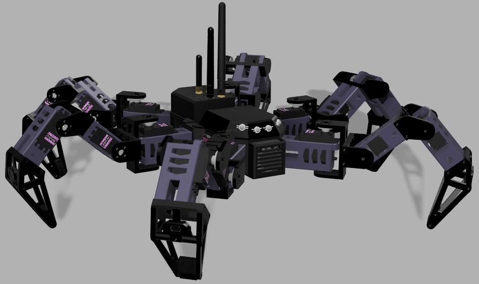

# SPECTRA Hexapod Robot

## Overview
Hexapod robot, with a platform for common frequency eploitation. Essentially, I wanted to make a flipper zero, but mobile.
S.P.E.C.T.R.A. abr. from Surveillance Patrol Electronic warfare Cyber warfare Tactical Reconnaissance Automaton.

## Table of Contents

1. [Introduction](#introduction)
2. [Features](#features)
3. [Hardware Requirements](#hardware-requirements)
4. [Software Requirements](#software-requirements)
5. [Assembly](#assembly)
6. [Modules](#modules)
   - [Wireless Exploitation Module](#wireless-exploitation-module)
   - [Electronic Warfare Module](#electronic-warfare-module)
7. [License](#license)

## Introduction

This Hexapod Robot is a six-legged robot equipped with electronic and cyber warfare capabilities. It is designed to navigate various terrains while executing tasks related to wireless exploitation, electronic warfare, and cyber reconnaissance. This project aims to provide a flexible and scalable platform for research and development in the field of offensive security.

## Features

- **Hexapod Locomotion:** The robot utilizes a hexapod design for enhanced mobility across diverse environments.
- **Modular Design:** The platform supports modular hardware and software components, allowing users to easily integrate additional functionalities.
- **Wireless Exploitation:** Equipped with dedicated modules, including CC1101 for sub GHz signals, nRF24L for 2.4 GHz applications, WiFi 2.4 GHz, Bluetooth, and Zigbee for cyber attacks.
- **Electronic Warfare Capabilities:** Integration of electronic warfare modules for signal interception, jamming, and analysis.
- **Cyber Reconnaissance:** The robot is capable of performing cyber reconnaissance tasks, collecting data on network vulnerabilities and security weaknesses.

## Hardware Requirements

- **Hexapod Chassis:** The hexapod robot chassis with six legs, motors, and sensors.
- **Microcontroller:** A powerful microcontroller (e.g., Raspberry Pi) for overall control and coordination.
- **Wireless Modules:** CC1101 for sub GHz signals, nRF24L for 2.4 GHz applications, and compatible modules for WiFi, Bluetooth, and Zigbee.

## Software Requirements

- **Operating System:** A Linux-based operating system (e.g., Raspbian) for the microcontroller. I used Raspberry Pi Zero 2.
- **Python Environment:** Python 3.x for running the control and exploitation scripts.
- **ROS (Robot Operating System):** ROS installation for effective communication and coordination between different modules.

## Assembly

Follow the detailed assembly instructions provided in the [Assembly Guide](docs/assembly.md) to put together the hexapod robot.

## Modules

### Wireless Exploitation Module

The wireless exploitation module allows the hexapod robot to perform tasks such as:

- Network scanning and reconnaissance
- Wireless network penetration testing
- Vulnerability identification

### Electronic Warfare Module

The electronic warfare module enhances the hexapod robot's capabilities for:

- Signal interception and analysis using CC1101, nRF24L, Bluetooth ESP32, Zigbee
- Jamming of wireless communications
- Spoofing
- Spectrum monitoring

Consult the [Electronic Warfare Module Guide](docs/modules/electronic_warfare.md) for comprehensive details.

## License

This project is licensed under the [MIT License](LICENSE.md). Feel free to use, modify, and distribute the code, subject to the terms and conditions of the license.
